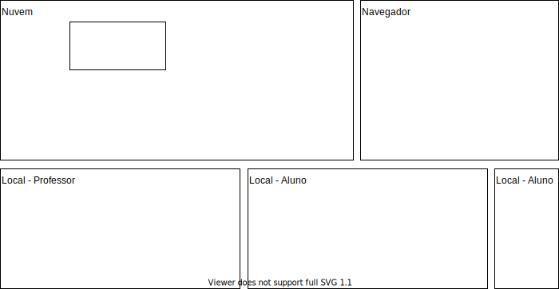

# tecnologia_Git

Material sobre versionador de código GIT.  
Estudando Versionador de Códigos (CVS/SVN/GIT).  

## MarginNote

<marginnote3app://note/1467C880-2120-4578-8085-B9B94313CFE2>  

## Git (Fluxograma)

  

## GIT (Controlador de Versão) - material

- sobre o GIT no VSCode acesse
  [Our top 20 tips and tricks](<https://vscode.github.com> "Our top 20 tips and tricks")  
  [<https://code.visualstudio.com/docs/editor/versioncontrol>](<https://code.visualstudio.com/docs/editor/versioncontrol> "Sobre o GIT no VSCode")

- sobre o GIT no geral
  
  [<https://git-scm.com>](<https://git-scm.com> "Sobre o GIT")

- para usar o GIT
  
  [<https://git-scm.com/download/win>](<https://git-scm.com/download/win> "Instalar o GIT")

- configure a ferramenta GIT: configure informações de usuário para todos os repositórios locais.  
  - configura o nome que você quer ligado às suas transações de commit:

    ```shell
    git config --global user.name "[nome]"
    ```

  - configura o email que você quer ligado às suas transações de commit:

    ```shell
    git config --global user.email "[endereco-de-email]"
    ```

- folha de dicas (_cheat-sheet_)

  [https://training.github.com/downloads/pt_BR/github-git-cheat-sheet/](https://training.github.com/downloads/pt_BR/github-git-cheat-sheet/ "cheat-sheet")

----

## Versionador de Códigos - GitHub

Existem várias opções para se versionar um código. Mas primeiro vamos entender o que seria "versionar" um código. O versionamento do código difere principalmente de um back-up (cópia de segurança) por além de duplicar os seus arquivos, também permitir um controle das alterações com um histórico associado a cada alteração.  
Então é importante entender a "cultura" e ter o hábito de usar o versionamento. Sim, é mais fácil em vez de se preocupar em fazer todas os passos necessários para se manter um código versionado, simplesmente salvar o seu código em uma pasta de um programa que faz o sincronismo do seu código local com espaços na nuvem (ex.: DropBox, BoxNet, OneDrive, GoogleDrive etc. - lembro, alguns destes espaços permitem também ter um controle de versionamento associado a sincronização). Mas o "sincronismo" de códigos não é igual a "versionamento". No sincronismo procurasse se manter uma única versão dos seus arquivos mantendo sempre a última versão. Sem se preocupar se em registrar estas alterações para gerenciar o processo de atualização. E quando falamos em "gerenciar" é permitir ter opções de volta na linha de tempo das atualizações, comparar os ajustes feitos por várias "mãos" (usuários diferentes), marcar um momento na linha do tempo, permitir ter linhas de tempo sendo registradas em paralelo, em outras funcionalidades.  
Sim, eu sei é muita coisa ... mas vamos com calma, um passo de cada vez. Se tens um editor de texto com milhares de funções não precisas conhecer todas as funções para começar a explorar uma poderosa ferramenta para editoração de texto para produzir os primeiros textos. Da mesma forma se pode iniciar com comandos básicos para começar a explorar a "cultura" em desenvolver código usando um versionador para controlar este processo.  
Em resumo, o "versionamento" de código é algo mais abrangente do que "sincronizar".  

Então vamos para o **básico** dos comandos de usado para versionar códigos:  

### Criar um repositório

Como comentei antes, existem várias opções para se versionar um código, aqui iremos usar o [GitHub](https://github.com "GitHub") (da Microsoft). O GitHub permite criar uma conta gratuitamente associando um e-mail válido. E tem planos gratuitos (com limitações) e pagos (com mais opções). Bom, a versão gratuita tem muitas funcionalidades, principalmente se optares por um repositório livre.  Ops, o que seria um repositório.  

#### Conceito de repositório

Repositórios é o conceito utilizado para o espaço onde os arquivos/pastas versionadas são armazenadas. O repositório pode estas em uma pasta local no seu computador (Repositório Local) ou armazenado na nuvem (Repositório Remoto), por exemplo mo GitHub. E assim se pode ter vários repositórios, mas geralmente se tem um Repositório Remoto e vários Locais (em computadores diferentes, com usuários diferentes).  Mas antes vamos rapidamente entender o que seria GIT.

##### GIT x SVN x CVS

Quando se fala em "versionar" códigos vem as palavras GIT, SVN e CVS. E estas palavras decorrente da evolução com o passar do tempo, sendo o CVS uma das primeiras formas de estruturas este gerenciamento de "versionamento" de códigos, seguido pelo SVN. Apesar de ainda existir muitos códigos sendo versionados pelos CVS e SVN, iremos nos concentrar na versão mais nova, o GIT.
Mas o que seria GIT, o GIT representa "um sistema de controle de versões distribuído". E a palavra "distribuído" é a principal parte que difere das opções mais antigas (CVS e SVN). Pois no GIT qualquer repositório pode ser sincronizado com outro repositório, sendo ele local ou remoto. Mas para não complicar iremos usar o modelo em se ter um Repositório Remoto e vários Repositórios Locais. E iremos "versionar" o código sempre entre um Repositório Local com um Repositório Remoto.  
E aproveitando vai a regra mais importante da "cultura" de versionar código ... **Sempre, mas SEMPRE, use o "versionamento" de código para "transferir" códigos entre repositórios**.  

##### Por que ter vários Repositórios Locais?

Bom, como comentei antes, iremos "versionar" o código entre Repositórios Locais (vários) e Repositório Remoto (só um). Então, por que ter vários Repositórios Locais? Bom, o mesmo usuário pode querer ter Repositórios Locais em computadores diferentes. Ou mesmo ter dois Repositórios Locais "versionando" com o mesmo Repositório Remoto. Ou ainda, um Repositório Remoto ser "versionado" por dois (ou mais) Repositórios Locais de usuários diferentes, cada um com sua "Linha do Tempo" de desenvolvimento.  

##### Linha do Tempo

Quando comentamos "Linha do Tempo" queremos referenciar todo o controle que é feito neste processo de versionamento. E cada Repositório (Local ou Remoto) tem a sua própria Linha do Tempo. Cada alteração que fizeres em seu Repositório pode ser registrada na Linha do Tempo usando o comando apropriado. E o "versionamento" se dá quando você deseja "unificar" as Linhas do Tempo" entre dois Repositórios, geralmente o seu Repositório Local com o Repositório Remoto.  
Mas antes vamos criar um Repositório.  

### Criar um repositório - agora Sim 😀

Primeiro iremos criar o Repositório Remoto no GitHub. Acesse [https://github.com](https://github.com "https://github.com") e crie uma conta (se já não tiver). No processo de criação da conta será pedido um nome de usuário (UserName). Se conseguir tente escolher algo que venha representar o seu portfólio de trabalhos desenvolvidos, que depois possa ser usado, por exemplo, como um dos pontos fortes do seu currículo. Eu tive sorte (pois está disponível) e optei pela forma mais simples, onde meu UserName no GitHub é **dalton-reis**. Se quiseres acessem o meu profile em: [https://github.com/dalton-reis](https://github.com/dalton-reis "https://github.com/dalton-reis").  
Bom, com o seu usuário, e *logado* no GitHub e em <https://github.com/UserName?tab=repositories>, onde o UserName é o seu usuário, deve aparecer a aba dos Repositórios. Nesta aba aparecem os seus repositórios já criados, e também a opção (botão) "New". Clicando neste botão se tem a opção "Create a new repository", onde se deve informar o nome e se vai ser um repositório público (Public) ou privado (Private). Por enquanto opte por ser um repositório público, mas cuidado, este tipo de repositório não dá permissão para qualquer um alterar, mas dá permissão para todos verem os códigos que estão nele.  
Bom, este repositório é o Repositório Remoto, aquele que fica persistido na  nuvem e vai ser usado para "versionarmos" os Repositórios Locais.
O próximo passo é fazer uma copia, ou seja, "clonar" este Repositório.  

### Clonar Repositório

Agora é momento de criar um Repositório Local, em seu computador. Uma das formas é abrindo o VSCode sem ter nenhum projeto aberto, e na janela "Explorer" clicar no botão "Clone Repository". E em seguida informar a URL do seu Repositório Remoto, algo do tipo: <https://github.com/dalton-reis/RepositoryName>, onde RepositoryName é nome do seu Repositório Remoto. Em seguida informe a pasta onde será criada uma nova pasta com o mesmo nome do Repositório Remoto, e com todos os arquivos e pastas "clonadas" localmente.
Nesta pasta local existe uma pasta com o nome ".git" que não deve ser usada (apaga, alterada etc.), pois é nesta pasta que é armazenada as informações de gerenciamento da "Linha do Tempo" usada no "versionamento". Também tem um arquivo chamado ".gitignore" que serve para indicar quais arquivos devem ser versionados ou não.

### VSCode - Source Control

Se estiveres no VSCode e com um projeto/pasta do Repositório Local é possível usar alguns comandos para o "versionamento". Lembrem, a pasta do Repositório Local é aquela que tem uma subpasta ".git".  
Para usar estes comandos abra a aba "Source Control" no VSCode. Vais observar que agora aparecem ao lado direito dos nomes dos arquivos umas letras coloridas.

- U (Untracked): arquivos/pastas novas. Ainda não estão sendo gerenciadas na "Linha do Tempo";
- A (Index Added): adicionado no Repositório Local, já aparece na Linha do Tempo, mas ainda não foi "versionado" com o Repositório Remoto;
- M (Modified): modificado no Repositório Local;

Bom, aqui vale uma explicação .. que basicamente se tem dois momentos:

- gerenciar os arquivos no Repositório Local que se refere a manter a "linha do Tempo" no Repositório Local;
- gerenciar o "versionamento", que consiste em "unificar" as linhas do tempo entre dois repositórios (Local e Remoto).

#### Comando Commit

As indicações das letras acima se referem a gerencia dos arquivos no Repositório Local. E quando um arquivo é alterado localmente ele aparece na aba "Source Control" no grupo "Changes". Em cada arquivo "alterado" tem a opção (sinal de +) para "Stage Changes", e assim os arquivos aparecem no grupo "Staged Changes". O que permite escrever uma mensagem ("Message") para fazer um "Commit". E agora os arquivos que estavam no grupo "Staged Changes" estão com seu histórico da linha do tempo atualizada no Repositório Local. Mas observe, só foi atualizado no Repositório Local.

#### Comando Pull, Push e Sync

Além de manter as alterações registradas na linha do tempo do Repositório Local usando o comando "Commit", se pode fazer o "versionamento" com o Repositório Remoto. E este "versionamento" e um caminho de duas vias, se podendo atualizar os códigos entre Repositório Local e Remoto, ou do Repositório Remoto com o Local. E assim se tem os comandos:

- Pull (puxar): Repositório Remoto -> Repositório Local;
- Push (empurrar): Repositório Local -> Repositório Remoto;
- Sync (sincronizar) Repositório Local <-> Repositório Remoto;

### O arquivo .gitignore

O arquivo ".gitignore" não é obrigatório, e pode já ser definido no momento da "Criar um repositório". No caso existem templates prontos para definir o ".gitignore", como pode ser visto em: [https://github.com/github/gitignore](https://github.com/github/gitignore "https://github.com/github/gitignore"). O como é um arquivo de texto plano é fácil modifica-lo e entender sua definição. Na aba "Source Control" é possível marcar um arquivo/pasta como "ignorado" (usando Add to .gitignore).  
Ou ainda, em: <https://www.toptal.com/developers/gitignore>  

### Git SubModule

[git-submodule](https://git-scm.com/docs/git-submodule)  
[stackoverflow git-submodule](https://stackoverflow.com/questions/36554810/how-to-link-folder-from-a-git-repo-to-another-repo)  

  git submodule add <url>  
  git submodule init  
  git submodule update  
  git submodule status

  cd pasta_git_submodule  
  git branch -a  
  git checkout release/nome_branch  
  git branch -a  

  cd ..
  git submodule status

### Tags

    git tag -a 0.0.1 -m Release: 0.0.1  

No VSCode:  

    Git: Create Tag
    Git: Push (Follow Tags)

### Criar Git usando Template

    gh repo create tcc_XYZ --private --template=https://github.com/dalton-reis/tcc__modelo
    cd /Users/daltonreis/GitHub/TCC
    gh repo clone https://github.com/dalton-reis/tcc_XYZ.git
    cd tcc_XYZ/_dalton
    gh repo sync
    ln -s /Users/daltonreis/GitHub/disciplinas/TCC1/disciplinaTCC1Privado/_._/OLD/2023-1/BCC/XYZ    TCC1
    cd ~

----

## Git Large File Storage

[git-lfs.com](https://git-lfs.com/)

----

## VSCode Extensões - GitFlow - mais extensões

Mostra o uso de algumas extensões, entre elas o GitFlow:  
  Original: <https://www.youtube.com/watch?v=7B6AtSMvX9k>  
  Local: [VSCodeGIT_extensoes.mp4](_._/VSCodeGIT_extensoes.mp4 "VSCodeGIT_extensoes.mp4")  
Indica um site que explica uma metodologia para criar Branches:  
  Original: <https://danielkummer.github.io/git-flow-cheatsheet/index.pt_BR.html>  
  Local: <marginnote3app://note/35D45FD0-0AD9-4D25-A781-E1CBDBF04EE4>

### GitFlow - Passos

- criar uma pasta com nome do repositório.  
- iniciar o GitLocal:  
    $ git init  
- abrir VSCode na pasta do projeto.  
- Command Palette: >GitFlow: Initialize repository for gitflow.  
- no Branch "develop"  
  - Command Palette: >GitFlow: Feature start.  
    - fazer os novos ajustes.  
  - Command Palette: >GitFlow: Feature finish.  
      vai trazer para branch developer os ajustes, e vai "matar" branch Feature.  
  - Command Palette: >GitFlow: Release start.  
    - registrar informações da nova Release.  
  - Command Palette: >GitFlow: Release finish.  
      vai trazer para branch developer e master todos os ajustes, e vai "matar" branch Release.  

Obs.: as branch Feature e Release ficam só no GitLocal, e as branch Develop e Master no GitLocal e GitRemoto.  

## GitHubFork

[GitHubFork](_._/GitHubFork.md "GitHubFork").  
[GitHubChechoutRemote](_._/GitHubChechoutRemote.md "GitHubChechoutRemote").  

## Git CheckOut

<https://blog.betrybe.com/git/git-checkout/#1>

## GIT (Gits)

Gits é um recurso adicional ao [GitHub](<https://github.com>) para permitir o compartilhamento de trechos de código, notas, listas de tarefas e muito mais. Você pode salvar seus Gists como privados ou públicos. Os Gists privados são ocultados dos motores de pesquisa, mas são visíveis para qualquer pessoa com quem partilhe o URL. Por exemplo. Se você quiser escrever uma lista particular de tarefas.

- Compartilhamento de códigos e notas relacionadas a disciplina de Introdução à Programação: <https://gist.github.com/dalton-reis>

## GIT (Discussions)

O **Discussions** é um espaço de discussões da nossa disciplina de Introdução à Programação. As discussões podem ser um lugar para nos conectarmos com outros membros da nossa disciplina. Neste espaço você pode:

- Perguntar sobre assuntos que você está com dúvidas.  
- Compartilhar ideias.  
- Conhecer outros membros da disciplina.  
- Dê boas-vindas aos outros e tenha a mente aberta.  

Lembre-se de que esta é uma comunidade que nós construímos juntos 💪.

## GitHubLearningLab

Para testar o uso do: <https://github.com/marketplace/github-learning-lab>  
Ver: <https://lab.github.com>  
Primeiro curso: <https://lab.github.com/githubtraining/introduction-to-github?overlay=register-box-overlay>  

----

## Fontes

<https://blog.betrybe.com/git>
<https://blog.betrybe.com/tecnologia/comandos-git/>

## Ler

[ ] [git-cheat-sheet-education.pdf](_._/git-cheat-sheet-education.pdf)  
[ ] 

----

## WakaTime

.  
